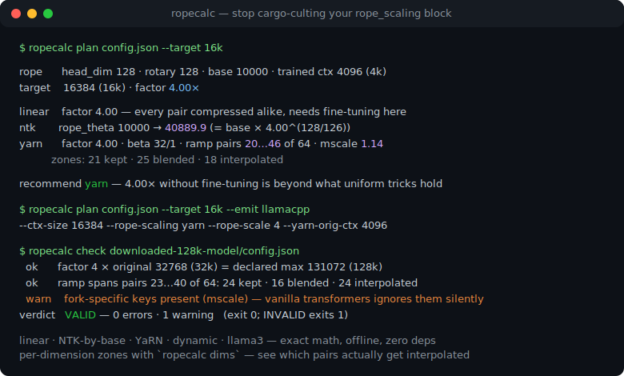
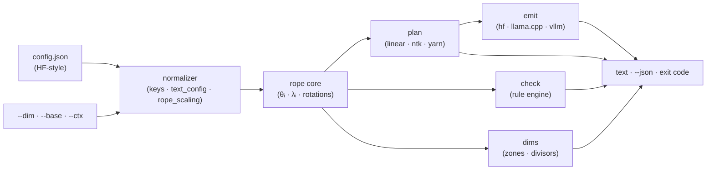

# ropecalc

[English](README.md) | [中文](README.zh.md) | [日本語](README.ja.md)

[](LICENSE)   [](CONTRIBUTING.md)

**コンテキスト拡張のための RoPE スケーリングパラメータを計算・検証：linear、NTK、YaRN。オフライン、正確、次元ごとに正直。**



```bash
# not yet on npm — install from a checkout of this repository
npm install && npm run build && npm pack
npm install -g ./ropecalc-0.1.0.tgz
```

## なぜ ropecalc？

コンテキスト拡張の設定はカーゴカルト化している：フォーラムの誰かが「`--rope-scale 4` を使え」と書き、config.json には手書きの `rope_scaling` ブロックが同梱され、誰も検算しない——その数学は推論エンジンのソースと 3 本の論文の中に埋まっているからだ。だが実際は、どの数値も手元の幾何量——head 次元、base、学習時コンテキスト——から導出できる。当てずっぽうの代償は静かで厄介だ：beta を逆に書いた YaRN ブロックは普通にロードされて全体を劣化させる。ファインチューニングなしの linear 係数 8 は検索性能を壊す。llama3 式の factor はコンテキスト倍率と誤読される（違う——帯域ごとの周波数除数だ）。dynamic NTK は長寿命の KV キャッシュを静かにドリフトさせる。ropecalc はずっと欠けていた単体計算機だ：config.json（あるいは `--dim/--base/--ctx` だけ）を指せば、正確なスケール済み base、補正レンジ、アテンション温度、次元ごとの除数が得られる——さらに各手法の本物の不変条件に照らして既存ブロックを監査するバリデータ、根拠を明記した推奨、HF transformers・llama.cpp・vLLM にそのまま貼れる出力まで。アカウント不要、アップロードなし、ソケットなし——永遠に。

| | ropecalc | フォーラムの言い伝え | ランタイムのソースを読む | 汎用のウェブ計算機 |
|---|---|---|---|---|
| 幾何量から linear/NTK/YaRN の正確なパラメータ | ✅ | ❌ 誰かのスクショ | 🟡 何時間も掘れば | 🟡 大抵 linear のみ |
| 既存の rope_scaling ブロックを検証 | ✅ 15+ ルール | ❌ | ❌ 黙って受理 | ❌ |
| 次元ごとのビュー（どのペアが補間されるか） | ✅ `dims` | ❌ | 🟡 print を足せば | ❌ |
| llama3 の factor ≠ 到達長・NTK の余裕・KV ドリフトを把握 | ✅ 組み込み済み | ❌ 罠そのもの | 🟡 精読すれば | ❌ |
| HF / llama.cpp / vLLM に貼れる出力 | ✅ 3 つとも | 🟡 どれか 1 つのフラグ | ❌ | ❌ |
| 完全オフライン動作、config はディスクを出ない | ✅ | — | ✅ | ❌ ブラウザ + サーバ |
| スクリプト対応：JSON 出力 + 終了コードゲート | ✅ | ❌ | ❌ | ❌ |
| ランタイム依存ゼロ | ✅ | — | — | — |

<sub>比較は各情報源の 2026-07 時点の典型的な振る舞いに基づく。ropecalc はスケーリングパラメータを計算しその不変条件を検証する。パープレキシティは予測しない——推奨ポリシーは公表済みの知見を符号化したもので、全公式とその限界は [docs/rope-math.md](docs/rope-math.md) に明記してある。</sub>

## 機能

- **3 つのレシピを一度に見積もる** — `ropecalc plan config.json --target 16k` は linear 係数、NTK のスケール済み base `b·s^(D/(D−2))`、YaRN の補正レンジ・ゾーン数・アテンション温度を並べて表示し、根拠付きの推奨を 1 つ添える。
- **計算機であると同時にバリデータ** — `ropecalc check` は実在のブロックを監査する：逆転した YaRN beta、有限でない factor、factor × original ≠ 宣言済み max、素の transformers が黙って捨てるフォーク専用キー、dynamic-NTK の KV キャッシュドリフト——VALID/INVALID の判定と終了コード付き。
- **次元ごとの正直さ** — `ropecalc dims` は各回転ペアの波長、学習中に回った回数、各手法が適用する除数を表示する——YaRN が *なぜ* ペア 0 を保持しペア 63 を補間するのかを説明する表だ。
- **ランタイムの癖を符号化** — 静的 NTK は `rope_theta` 上書きとして出力（HF に該当タイプはない）、llama.cpp が自前導出する YaRN 温度は二重適用しない、vLLM はインライン JSON ブロック；罠は頭の中ではなくツールに住まわせる。
- **キー駆動、名前非依存** — ropecalc は設定キー（`rope_theta`、`partial_rotary_factor`、`text_config`、`rope_scaling.rope_type` など）だけを読み、モデル名は一切照合しない。キーを再利用する新モデルは登場当日から動く。
- **スクリプトのために** — 全コマンドに `--json`、同一入力にはバイト単位で同一の出力、終了コード 0（有効）/ 1（チェック失敗または目標未達）/ 2（用法エラー）、注記は stderr のみ。
- **ランタイム依存ゼロ、完全オフライン** — 必要なのは Node.js だけ。ropecalc はソケットを開かず、devDependency は `typescript` のみ。

## クイックスタート

定番シナリオ：4k 学習・base 10000 の 7B を 16k に伸ばす。

```bash
ropecalc plan examples/base-10k-7b.json --target 16k
```

出力（実キャプチャ。各手法の注記行はここでは省略）：

```text
ropecalc 0.1.0 — scaling plan

model     examples/base-10k-7b.json
rope      head_dim 128 · rotary 128 · base 10000 · trained ctx 4096 (4k)
target    16384 (16k) · factor 4.00×

linear    factor 4.00
ntk       rope_theta 10000 → 40889.9 (= base × 4.00^(128/126))
yarn      factor 4.00 · beta 32/1 · ramp pairs 20…46 of 64 · mscale 1.14
          zones: 21 kept · 25 blended · 18 interpolated

recommend yarn — 4.00× without fine-tuning is beyond what uniform tricks hold; YaRN's wavelength-aware blend plus attention temperature degrades the least
```

`--emit llamacpp`（または `hf`、`vllm`）を足せば、stdout がそのまま貼り付けられる設定になる（実キャプチャ）：

```text
--ctx-size 16384 --rope-scaling yarn --rope-scale 4 --yarn-orig-ctx 4096
```

そしてダウンロードした「128k」モデルを信じる前にブロックを監査する——細工されたものは大きな音で落ちる（実キャプチャ、findings 部分；終了コード 1）：

```text
  ok      rope_scaling type "yarn" is a recognized scaling scheme
  info    block uses the legacy "type" key — modern runtimes also accept "rope_type"
  ok      factor 16 is in range
  warn    original_max_position_embeddings missing — transformers falls back to max_position_embeddings (4096), which is wrong once that key holds the extended length
  error   beta_fast (1) must be greater than beta_slow (32) — as given, the ramp is inverted
  error   attention_factor -1 must be > 0

verdict   INVALID — 2 errors · 1 warning
```

健全な設定、llama3 の帯域、ペアごとの表は [examples/](examples/README.md) に。全公式は [docs/rope-math.md](docs/rope-math.md) に書き下してある。

## コマンド

| コマンド | 内容 | 主なオプション |
|---|---|---|
| `plan <config>` | 3 手法の正確なパラメータ + 推奨 | `--target`、`--method`、`--emit`、`--finetune`、`--json` |
| `check <config>` | 既存の rope_scaling ブロックを監査 | `--target`、`--strict`、`--json` |
| `dims <config>` | ペアごとの波長・ゾーン・除数 | `--target`、`--all`、`--beta-fast/slow`、`--json` |
| `methods` | リファレンス：5 方式の公式と出典 | `--json` |

config ファイルが手元にない？ `--dim 128 --base 10000 --ctx 4096` で代用できる。コンテキスト長は `16384`、`16k`（= ×1024）、`1m`（= ×1024²）のいずれの表記も受け付ける。終了コードはスクリプト向け：`0` 正常/有効、`1` チェック失敗または `--target` 未達、`2` 用法・設定エラー。

## どの手法をいつ使うか

| 手法 | 設定方法 | 無調整で使える？ | 持つ範囲 | 落とし穴 |
|---|---|---|---|---|
| linear (PI) | `rope_type: "linear"` | 🟡 約 2× | ファインチューニングで約 4× | 局所の細部も全域と同じ強さで圧縮する |
| NTK（静的） | `rope_theta` 上書き | ✅ | 約 2× | 目標付近で到達範囲が縮む——余裕を持たせる |
| YaRN | `rope_type: "yarn"` | ✅ | 無調整で約 4×、調整すればそれ以上 | `original_max_position_embeddings` を正しく設定する必要 |

これが `plan` の実装する推奨ポリシーで（`--finetune` で切り替わる）、根拠は `ropecalc methods` が引用する論文——ropecalc が代わりに走らせたベンチマークではない。

## アーキテクチャ



## ロードマップ

- [x] RoPE コア、plan/check/dims/methods コマンド、HF と一致する YaRN + llama3 + dynamic-NTK の数学、15+ の検証ルール、3 ランタイム向け emit、フラグのみの幾何入力、JSON + 終了コード契約、89 テスト + スモークスクリプト（v0.1.0）
- [ ] `compare` コマンド：2 つの設定のスケール後 inv_freq テンソルを並べて比較（このファインチューニングは本当に rope を変えたのか？）
- [ ] GGUF メタデータから幾何量を直接読んでクロスチェック
- [ ] LongRoPE 式の次元別リスケール係数（まず検証から）
- [ ] 公表済み評価に基づくパープレキシティ準拠のガイド表（引用をインラインで）
- [ ] npm への公開

完全なリストは [open issues](https://github.com/JaydenCJ/ropecalc/issues) を参照。

## コントリビュート

コントリビューションを歓迎する。`npm install && npm run build` でビルドし、`npm test` と `bash scripts/smoke.sh`（`SMOKE OK` と出力されること）を実行——このリポジトリは CI を持たず、上記の主張はすべてローカル実行で検証される。[CONTRIBUTING.md](CONTRIBUTING.md) を読み、[good first issue](https://github.com/JaydenCJ/ropecalc/issues?q=is%3Aissue+is%3Aopen+label%3A%22good+first+issue%22) を選ぶか、[discussion](https://github.com/JaydenCJ/ropecalc/discussions) を始めてほしい。

## ライセンス

[MIT](LICENSE)
