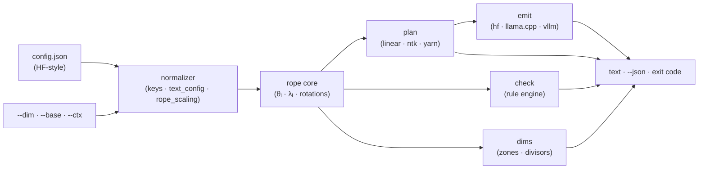

# ropecalc

[English](README.md) | [中文](README.zh.md) | [日本語](README.ja.md)

[](LICENSE)   [](CONTRIBUTING.md)

**Computes and validates RoPE scaling parameters for context extension: linear, NTK, YaRN. Offline, exact, per-dimension honest.**


```bash
# not yet on npm — install from a checkout of this repository
npm install && npm run build && npm pack
npm install -g ./ropecalc-0.1.0.tgz
```

## Why ropecalc?

Context-extension settings are cargo-culted: someone on a forum posts "use `--rope-scale 4`", a config.json ships with a hand-edited `rope_scaling` block, and nobody checks the math — because the math is buried in runtime source and three papers. Yet every number is derivable from geometry you already have: the head dimension, the base, the trained context. The consequences of guessing are quiet and nasty — a YaRN block with swapped betas loads fine and degrades everything; a linear factor of 8 without fine-tuning ruins retrieval; a llama3-style factor gets misread as a context multiplier (it isn't — it's a per-band frequency divisor); dynamic NTK silently drifts long-lived KV caches. ropecalc is the missing standalone calculator: point it at a config.json (or just `--dim/--base/--ctx`) and get the exact scaled base, correction range, attention temperature and per-dimension divisors — plus a validator that audits existing blocks against each method's real invariants, a recommendation with its reasoning stated, and paste-ready emits for HF transformers, llama.cpp and vLLM. No account, no upload, no socket — ever.

| | ropecalc | Forum folklore | Reading runtime source | Generic web calculators |
|---|---|---|---|---|
| Exact linear/NTK/YaRN parameters from geometry | ✅ | ❌ someone's screenshot | 🟡 after hours of digging | 🟡 linear-only, usually |
| Validates existing rope_scaling blocks | ✅ 15+ rules | ❌ | ❌ silent acceptance | ❌ |
| Per-dimension view (which pairs interpolate) | ✅ `dims` | ❌ | 🟡 add print statements | ❌ |
| Knows llama3 factor ≠ reach, NTK headroom, KV drift | ✅ encoded | ❌ the trap itself | 🟡 if you read carefully | ❌ |
| Paste-ready output for HF / llama.cpp / vLLM | ✅ all three | 🟡 one runtime's flags | ❌ | ❌ |
| Runs fully offline, config never leaves disk | ✅ | — | ✅ | ❌ browser + server |
| Scriptable: JSON output + exit-code gate | ✅ | ❌ | ❌ | ❌ |
| Zero runtime dependencies | ✅ | — | — | — |

<sub>Comparison against each source's typical behavior, 2026-07. ropecalc computes the scaling parameters and validates their invariants; it does not predict perplexity — the recommendation policy encodes published findings, and [docs/rope-math.md](docs/rope-math.md) states every formula and its limits.</sub>

## Features

- **All three recipes, priced out at once** — `ropecalc plan config.json --target 16k` prints the linear factor, the NTK scaled base `b·s^(D/(D−2))`, and YaRN's correction range, zone counts and attention temperature, side by side with one reasoned recommendation.
- **A validator, not just a calculator** — `ropecalc check` audits real-world blocks: inverted YaRN betas, non-finite factors, factor × original ≠ declared max, fork-only keys vanilla transformers silently drops, dynamic-NTK KV-cache drift — with a VALID/INVALID verdict and exit code.
- **Per-dimension honesty** — `ropecalc dims` shows every rotation pair's wavelength, how often it rotated during training, and the divisor each method applies — the table that explains *why* YaRN keeps pair 0 and interpolates pair 63.
- **Runtime quirks encoded** — static NTK emitted as a `rope_theta` override (HF has no type for it), llama.cpp's self-derived YaRN temperature not double-applied, vLLM's inline JSON block; the traps live in the tool, not in your head.
- **Key-driven, not name-driven** — ropecalc reads config keys (`rope_theta`, `partial_rotary_factor`, `text_config`, `rope_scaling.rope_type`, …) and never matches model names, so new models that reuse the keys work the day they drop.
- **Built for scripts** — `--json` on every command, byte-identical output for identical inputs, exit codes 0 (valid) / 1 (check failed or target unreachable) / 2 (usage error), notes on stderr only.
- **Zero runtime dependencies, fully offline** — Node.js is the only requirement; ropecalc never opens a socket, and `typescript` is the sole devDependency.

## Quickstart

The classic: stretch a 4k-trained, 10000-base 7B to 16k.

```bash
ropecalc plan examples/base-10k-7b.json --target 16k
```

Output (real captured run; the per-method note lines are elided here):

```text
ropecalc 0.1.0 — scaling plan

model     examples/base-10k-7b.json
rope      head_dim 128 · rotary 128 · base 10000 · trained ctx 4096 (4k)
target    16384 (16k) · factor 4.00×

linear    factor 4.00
ntk       rope_theta 10000 → 40889.9 (= base × 4.00^(128/126))
yarn      factor 4.00 · beta 32/1 · ramp pairs 20…46 of 64 · mscale 1.14
          zones: 21 kept · 25 blended · 18 interpolated

recommend yarn — 4.00× without fine-tuning is beyond what uniform tricks hold; YaRN's wavelength-aware blend plus attention temperature degrades the least
```

Add `--emit llamacpp` (or `hf`, `vllm`) and stdout becomes exactly the settings to paste (real captured run):

```text
--ctx-size 16384 --rope-scaling yarn --rope-scale 4 --yarn-orig-ctx 4096
```

And before trusting a downloaded "128k" model, audit its block — a sabotaged one fails loudly (real captured run, findings section; exit code 1):

```text
  ok      rope_scaling type "yarn" is a recognized scaling scheme
  info    block uses the legacy "type" key — modern runtimes also accept "rope_type"
  ok      factor 16 is in range
  warn    original_max_position_embeddings missing — transformers falls back to max_position_embeddings (4096), which is wrong once that key holds the extended length
  error   beta_fast (1) must be greater than beta_slow (32) — as given, the ramp is inverted
  error   attention_factor -1 must be > 0

verdict   INVALID — 2 errors · 1 warning
```

Sound configs, llama3 bands and the per-pair table live in [examples/](examples/README.md); every formula is written out in [docs/rope-math.md](docs/rope-math.md).

## Commands

| Command | Does | Key options |
|---|---|---|
| `plan <config>` | exact parameters for all three methods + recommendation | `--target`, `--method`, `--emit`, `--finetune`, `--json` |
| `check <config>` | audit an existing rope_scaling block | `--target`, `--strict`, `--json` |
| `dims <config>` | per-pair wavelengths, zones and divisors | `--target`, `--all`, `--beta-fast/slow`, `--json` |
| `methods` | reference: formulas + provenance for all five schemes | `--json` |

No config file at hand? `--dim 128 --base 10000 --ctx 4096` replaces it. Context lengths accept `16384`, `16k` (= ×1024) and `1m` (= ×1024²). Exit codes are script-friendly: `0` ok/valid, `1` check failed or `--target` out of reach, `2` usage or config error.

## Which method, when

| Method | Set via | Drop-in? | Holds to | The catch |
|---|---|---|---|---|
| linear (PI) | `rope_type: "linear"` | 🟡 ~2× | ~4× with fine-tuning | compresses local detail as hard as global |
| NTK (static) | `rope_theta` override | ✅ | ~2× | reach shrinks near the target — plan headroom |
| YaRN | `rope_type: "yarn"` | ✅ | ~4× drop-in, more tuned | needs `original_max_position_embeddings` set right |

This is the recommendation policy `plan` implements (`--finetune` switches it), derived from the papers cited in `ropecalc methods` — not from a benchmark ropecalc ran for you.

## Architecture



## Roadmap

- [x] RoPE core, plan/check/dims/methods commands, YaRN + llama3 + dynamic-NTK math with HF-matching semantics, 15+ validation rules, three-runtime emits, flag-only geometry, JSON + exit-code contract, 89 tests + smoke script (v0.1.0)
- [ ] `compare` command: side-by-side scaled inv_freq tensors for two configs (did this fine-tune actually change the rope?)
- [ ] Read geometry directly from GGUF metadata as a cross-check
- [ ] LongRoPE-style per-dimension rescale factors (validation first)
- [ ] Optional perplexity-anchored guidance tables from published evals, with citations inline
- [ ] Publish to npm

See the [open issues](https://github.com/JaydenCJ/ropecalc/issues) for the full list.

## Contributing

Contributions are welcome. Build with `npm install && npm run build`, then run `npm test` and `bash scripts/smoke.sh` (must print `SMOKE OK`) — this repository ships no CI, every claim above is verified by local runs. See [CONTRIBUTING.md](CONTRIBUTING.md), grab a [good first issue](https://github.com/JaydenCJ/ropecalc/issues?q=is%3Aissue+is%3Aopen+label%3A%22good+first+issue%22), or start a [discussion](https://github.com/JaydenCJ/ropecalc/discussions).

## License

[MIT](LICENSE)
