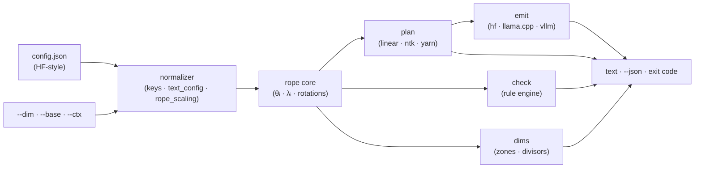

# ropecalc

[English](README.md) | [中文](README.zh.md) | [日本語](README.ja.md)

[](LICENSE)   [](CONTRIBUTING.md)

**计算并校验上下文扩展用的 RoPE 缩放参数：linear、NTK、YaRN。离线、精确、逐维度诚实。**


```bash
# not yet on npm — install from a checkout of this repository
npm install && npm run build && npm pack
npm install -g ./ropecalc-0.1.0.tgz
```

## 为什么是 ropecalc？

长上下文扩展的参数一直靠口口相传：论坛上有人贴一句「用 `--rope-scale 4`」，config.json 里带着一块手改的 `rope_scaling`，没有人去验算——因为这些数学埋在推理引擎源码和三篇论文里。可其实每个数字都能从你手头现成的几何量推出来：head 维度、base、训练上下文长度。乱猜的后果安静而致命——beta 写反的 YaRN 块照样加载、然后劣化一切；不做微调的 linear 因子 8 会毁掉检索；llama3 式的 factor 常被误读成上下文倍数（并不是——它是分频段的频率除数）；dynamic NTK 会让长期存活的 KV cache 悄悄漂移。ropecalc 就是那个一直缺席的独立计算器：指向一个 config.json（或者只给 `--dim/--base/--ctx`），就能得到精确的缩放 base、修正区间、注意力温度和逐维度除数——外加一个按各方法真实不变量审计既有配置块的校验器、一条讲明理由的推荐、以及可直接粘贴到 HF transformers、llama.cpp 与 vLLM 的输出。没有账号、没有上传、没有套接字——永远没有。

| | ropecalc | 论坛言传 | 阅读运行时源码 | 泛泛的网页计算器 |
|---|---|---|---|---|
| 从几何量算出精确的 linear/NTK/YaRN 参数 | ✅ | ❌ 别人的截图 | 🟡 挖上几小时之后 | 🟡 通常只有 linear |
| 校验既有的 rope_scaling 块 | ✅ 15+ 条规则 | ❌ | ❌ 静默接受 | ❌ |
| 逐维度视图（哪些 pair 被插值） | ✅ `dims` | ❌ | 🟡 自己加 print | ❌ |
| 懂 llama3 factor ≠ 可达长度、NTK 余量、KV 漂移 | ✅ 已内置 | ❌ 陷阱本身 | 🟡 读得够细才行 | ❌ |
| 可直接粘贴的 HF / llama.cpp / vLLM 输出 | ✅ 三家全有 | 🟡 只有某一家的旗标 | ❌ | ❌ |
| 完全离线运行，config 不离盘 | ✅ | — | ✅ | ❌ 浏览器 + 服务器 |
| 可脚本化：JSON 输出 + 退出码闸门 | ✅ | ❌ | ❌ | ❌ |
| 零运行时依赖 | ✅ | — | — | — |

<sub>对比基于各来源 2026-07 的典型表现。ropecalc 计算缩放参数并校验其不变量；它不预测困惑度——推荐策略编码的是已发表的结论，每条公式及其局限见 [docs/rope-math.md](docs/rope-math.md)。</sub>

## 功能

- **三种配方一次算清** — `ropecalc plan config.json --target 16k` 并排打印 linear 因子、NTK 缩放 base `b·s^(D/(D−2))`、以及 YaRN 的修正区间、分区统计和注意力温度，外加一条讲明理由的推荐。
- **是校验器，不只是计算器** — `ropecalc check` 审计真实世界的配置块：写反的 YaRN beta、非有限的 factor、factor × original ≠ 声明的 max、vanilla transformers 会静默丢弃的分叉专用键、dynamic-NTK 的 KV cache 漂移——给出 VALID/INVALID 判决和退出码。
- **逐维度的诚实** — `ropecalc dims` 展示每个旋转 pair 的波长、训练期间转了多少圈、以及各方法施加的除数——正是这张表解释了 YaRN *为什么* 保留 pair 0 而插值 pair 63。
- **运行时怪癖已内置** — 静态 NTK 以 `rope_theta` 覆盖形式输出（HF 没有对应类型）、llama.cpp 自行推导的 YaRN 温度不会被重复施加、vLLM 用内联 JSON 块；陷阱住在工具里，而不是你脑子里。
- **按键驱动，不认名字** — ropecalc 只读配置键（`rope_theta`、`partial_rotary_factor`、`text_config`、`rope_scaling.rope_type`……），从不匹配模型名，复用这些键的新模型发布当天即可用。
- **为脚本而生** — 每个命令都有 `--json`，相同输入产出字节级一致的输出，退出码 0（有效）/ 1（检查失败或目标不可达）/ 2（用法错误），提示只走 stderr。
- **零运行时依赖，完全离线** — 只需要 Node.js；ropecalc 从不打开套接字，`typescript` 是唯一的 devDependency。

## 快速上手

经典场景：把一个 4k 训练、base 10000 的 7B 拉到 16k。

```bash
ropecalc plan examples/base-10k-7b.json --target 16k
```

输出（真实捕获；此处省略了各方法的注释行）：

```text
ropecalc 0.1.0 — scaling plan

model     examples/base-10k-7b.json
rope      head_dim 128 · rotary 128 · base 10000 · trained ctx 4096 (4k)
target    16384 (16k) · factor 4.00×

linear    factor 4.00
ntk       rope_theta 10000 → 40889.9 (= base × 4.00^(128/126))
yarn      factor 4.00 · beta 32/1 · ramp pairs 20…46 of 64 · mscale 1.14
          zones: 21 kept · 25 blended · 18 interpolated

recommend yarn — 4.00× without fine-tuning is beyond what uniform tricks hold; YaRN's wavelength-aware blend plus attention temperature degrades the least
```

加上 `--emit llamacpp`（或 `hf`、`vllm`），stdout 就变成可直接粘贴的设置（真实捕获）：

```text
--ctx-size 16384 --rope-scaling yarn --rope-scale 4 --yarn-orig-ctx 4096
```

在相信一个下载来的「128k」模型之前，先审计它的配置块——被动过手脚的会响亮地失败（真实捕获，findings 部分；退出码 1）：

```text
  ok      rope_scaling type "yarn" is a recognized scaling scheme
  info    block uses the legacy "type" key — modern runtimes also accept "rope_type"
  ok      factor 16 is in range
  warn    original_max_position_embeddings missing — transformers falls back to max_position_embeddings (4096), which is wrong once that key holds the extended length
  error   beta_fast (1) must be greater than beta_slow (32) — as given, the ramp is inverted
  error   attention_factor -1 must be > 0

verdict   INVALID — 2 errors · 1 warning
```

健康的配置、llama3 频段和逐 pair 表格见 [examples/](examples/README.md)；每条公式都写在 [docs/rope-math.md](docs/rope-math.md) 里。

## 命令

| 命令 | 作用 | 关键选项 |
|---|---|---|
| `plan <config>` | 三种方法的精确参数 + 推荐 | `--target`、`--method`、`--emit`、`--finetune`、`--json` |
| `check <config>` | 审计既有的 rope_scaling 块 | `--target`、`--strict`、`--json` |
| `dims <config>` | 逐 pair 的波长、分区与除数 | `--target`、`--all`、`--beta-fast/slow`、`--json` |
| `methods` | 参考表：五种方案的公式与出处 | `--json` |

手头没有 config 文件？用 `--dim 128 --base 10000 --ctx 4096` 代替。上下文长度接受 `16384`、`16k`（= ×1024）和 `1m`（= ×1024²）几种写法。退出码对脚本友好：`0` 正常/有效，`1` 检查失败或 `--target` 不可达，`2` 用法或配置错误。

## 什么时候用哪种方法

| 方法 | 设置方式 | 免调优直接用？ | 可撑到 | 坑 |
|---|---|---|---|---|
| linear (PI) | `rope_type: "linear"` | 🟡 约 2× | 微调后约 4× | 压缩局部细节与全局同样狠 |
| NTK（静态） | `rope_theta` 覆盖 | ✅ | 约 2× | 逼近目标时可达范围收缩——要留余量 |
| YaRN | `rope_type: "yarn"` | ✅ | 直接用约 4×，微调更高 | 必须把 `original_max_position_embeddings` 设对 |

这就是 `plan` 实现的推荐策略（`--finetune` 会切换它），依据是 `ropecalc methods` 引用的论文——不是 ropecalc 替你跑的基准测试。

## 架构



## 路线图

- [x] RoPE 核心、plan/check/dims/methods 命令、与 HF 语义一致的 YaRN + llama3 + dynamic-NTK 数学、15+ 条校验规则、三家运行时的 emit、纯旗标几何输入、JSON + 退出码契约、89 个测试 + 冒烟脚本（v0.1.0）
- [ ] `compare` 命令：并排对比两个配置缩放后的 inv_freq 张量（这次微调真的改了 rope 吗？）
- [ ] 直接从 GGUF 元数据读取几何量做交叉校验
- [ ] LongRoPE 式的逐维度重缩放因子（先做校验）
- [ ] 可选的、锚定困惑度的指导表，取自已发表评测并内联引用
- [ ] 发布到 npm

完整列表见 [open issues](https://github.com/JaydenCJ/ropecalc/issues)。

## 参与贡献

欢迎贡献。用 `npm install && npm run build` 构建，然后运行 `npm test` 和 `bash scripts/smoke.sh`（必须打印 `SMOKE OK`）——本仓库不带 CI，上面的每条声明都由本地运行验证。参见 [CONTRIBUTING.md](CONTRIBUTING.md)，认领一个 [good first issue](https://github.com/JaydenCJ/ropecalc/issues?q=is%3Aissue+is%3Aopen+label%3A%22good+first+issue%22)，或发起一个 [discussion](https://github.com/JaydenCJ/ropecalc/discussions)。

## 许可证

[MIT](LICENSE)
